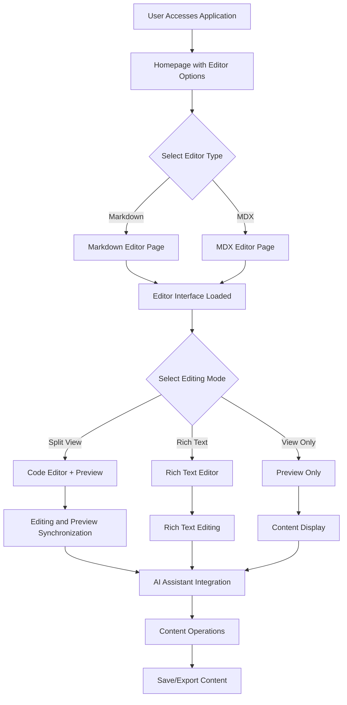
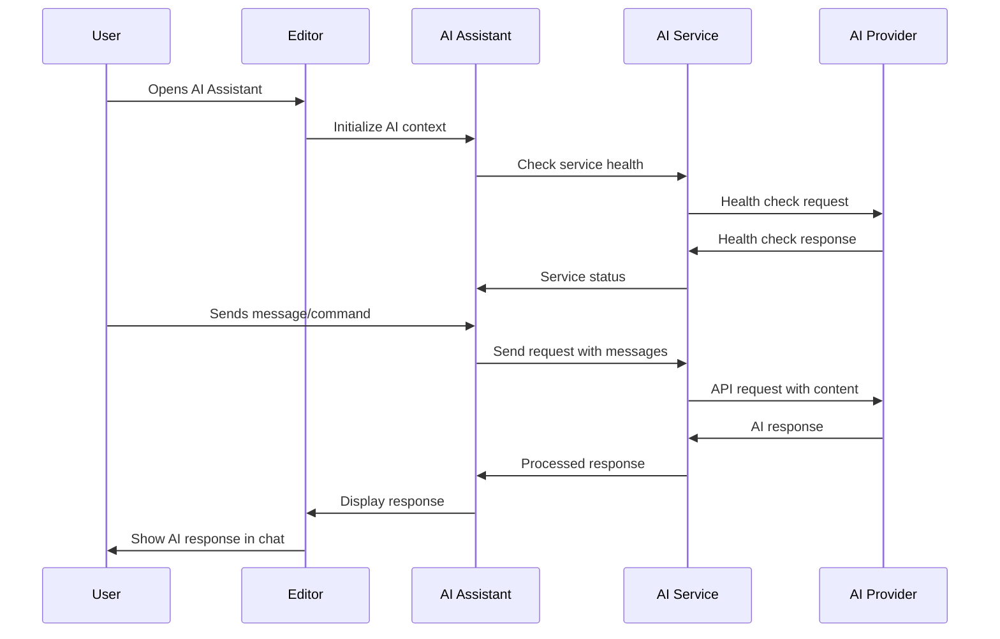

# Requirements Documentation

This document outlines the requirements, project operations, and acceptance criteria for the MDX Editor project.

## Project Overview

The MDX Editor is a modern web application built with Next.js that provides a powerful editing environment for both Markdown and MDX content. It features live preview, AI assistance, and a rich set of editing tools.

## Functional Requirements

### Core Features

1. **Dual Editing Modes**
   - Markdown editing with live preview
   - MDX editing with React component support
   - Real-time synchronization between editor and preview

2. **Editor Functionality**
   - Code editor with syntax highlighting (Monaco Editor)
   - Rich text editor (TipTap) for WYSIWYG editing
   - Split view mode with resizable panels
   - Formatting toolbar with common Markdown/MDX elements

3. **AI Assistance**
   - Integration with multiple AI providers (OpenAI, Google Gemini, OpenRouter)
   - Runtime API key configuration
   - Content improvement suggestions
   - Grammar and spelling correction
   - Content expansion and summarization

4. **MDX Component Support**
   - Custom React components (Callouts, Counters, Progress Bars, etc.)
   - Component insertion via toolbar
   - Proper rendering in preview panel

5. **User Experience**
   - Responsive design for all device sizes
   - Dark/light theme support
   - Smooth animations and transitions
   - Intuitive UI with glassmorphism design elements

## Non-Functional Requirements

### Performance
- Fast loading times (< 3 seconds for initial page load)
- Smooth typing experience with minimal lag
- Efficient rendering of preview content
- Optimized bundle sizes

### Security
- Secure storage of API keys in localStorage
- Environment variable fallback for API keys
- Protection against XSS in content rendering

### Usability
- Intuitive navigation and workflow
- Clear error messaging
- Accessible UI components
- Comprehensive keyboard shortcuts

## Acceptance Criteria

### Editor Functionality
- [ ] Users can create, edit, and preview Markdown content
- [ ] Users can create, edit, and preview MDX content with React components
- [ ] Split view mode allows simultaneous editing and preview
- [ ] Rich text mode provides WYSIWYG editing experience
- [ ] View-only mode displays content without editing capabilities
- [ ] All formatting toolbar actions work correctly
- [ ] MDX components render properly in preview

### AI Integration
- [ ] Users can configure API keys at runtime
- [ ] AI assistant works with all supported providers
- [ ] Quick actions (improve, expand, summarize, correct) function properly
- [ ] AI responses are properly formatted and inserted
- [ ] Error handling for API failures is implemented

### User Interface
- [ ] Responsive design works on mobile, tablet, and desktop
- [ ] Dark/light theme toggle functions correctly
- [ ] All interactive elements provide visual feedback
- [ ] Smooth transitions between views and states

## Workflows

### AI Assistant Workflow

## Project Operations

### Development Workflow
1. Clone repository
2. Install dependencies with `yarn install`
3. Configure environment variables
4. Run development server with `yarn dev`

### Deployment
1. Build production version with `yarn build`
2. Start production server with `yarn start`
3. Deploy to hosting platform (Vercel recommended)

### Bundle Analysis
1. Analyze bundles with `yarn analyze`
2. Review client/server bundle sizes
3. Optimize large dependencies

## Technical Constraints

1. **Framework**: Next.js 15+ with App Router
2. **Language**: TypeScript
3. **UI Library**: Material-UI (MUI)
4. **Editor Libraries**: Monaco Editor, TipTap
5. **AI Libraries**: Vercel AI SDK
6. **Styling**: CSS-in-JS with MUI's sx prop
7. **State Management**: React Context API
8. **Build Tool**: Webpack (Next.js default)

## Dependencies

### Core Dependencies
- `next`: React framework
- `react`/`react-dom`: UI library
- `@mui/material`: Component library
- `@monaco-editor/react`: Code editor
- `@tiptap/*`: Rich text editor
- `ai`: Vercel AI SDK
- `@ai-sdk/*`: AI provider integrations

### Development Dependencies
- `typescript`: Type checking
- `eslint`: Code linting
- `@next/bundle-analyzer`: Bundle analysis