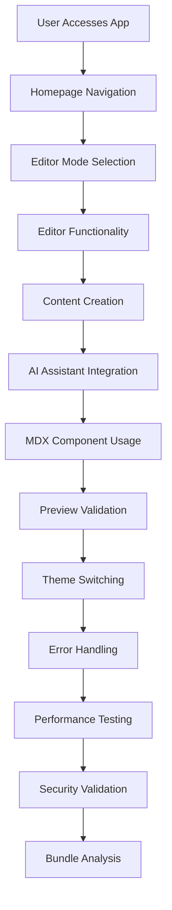

# 🧪 MDX Editor - Comprehensive Test Cases

## 📋 Summary

This document outlines comprehensive test cases for the MDX Editor project, covering all major features and functionality. The test cases are organized into logical groups to ensure complete coverage of the application's capabilities.

### 📊 Test Case Overview

| Test Group | Number of Cases | Description |
|------------|----------------|-------------|
| Core Editor Functionality | 30 | Testing basic editor operations in both Markdown and MDX modes |
| AI Integration | 35 | Verifying AI assistant functionality with all providers and runtime key management |
| MDX Components | 20 | Testing custom MDX component rendering and interaction |
| UI/UX Features | 25 | Validating user interface elements and user experience |
| Theme System | 10 | Testing light/dark theme functionality |
| Error Handling | 15 | Verifying error handling and recovery mechanisms |
| Performance | 12 | Checking performance aspects of the application |
| Security | 8 | Validating security measures |
| Bundle Analysis | 5 | Testing bundle analyzer functionality |
| **Total** | **160** | **Comprehensive test coverage** |

### 🔄 Test Workflow Overview



## 🧪 Detailed Test Cases

### 1. 📝 Core Editor Functionality

#### 1.1. Editor Mode Selection
1. **TC-EDITOR-001**: Verify user can select Markdown mode from homepage
2. **TC-EDITOR-002**: Verify user can select MDX mode from homepage
3. **TC-EDITOR-003**: Verify editor loads correctly for Markdown mode
4. **TC-EDITOR-004**: Verify editor loads correctly for MDX mode
5. **TC-EDITOR-005**: Verify editor mode persists in URL parameters

#### 1.2. Editor View Modes
6. **TC-EDITOR-006**: Verify Split View mode functionality for Markdown
7. **TC-EDITOR-007**: Verify Split View mode functionality for MDX
8. **TC-EDITOR-008**: Verify Rich Text mode functionality for Markdown
9. **TC-EDITOR-009**: Verify View Only mode functionality for MDX (should fallback to View Only)
10. **TC-EDITOR-010**: Verify mode switching between Split, Rich, and View modes
11. **TC-EDITOR-011**: Verify content persistence during mode switching
12. **TC-EDITOR-012**: Verify MDX mode correctly disables Rich Text editor option
13. **TC-EDITOR-013**: Verify Markdown mode correctly disables View Only mode option

#### 1.3. Code Editor Features
14. **TC-EDITOR-014**: Verify syntax highlighting in Code Editor
15. **TC-EDITOR-015**: Verify cursor position preservation during typing
16. **TC-EDITOR-016**: Verify content updates from external sources
17. **TC-EDITOR-017**: Verify split pane resizing functionality
18. **TC-EDITOR-018**: Verify Monaco Editor toolbar integration
19. **TC-EDITOR-019**: Verify code folding functionality
20. **TC-EDITOR-020**: Verify line numbers display and navigation
21. **TC-EDITOR-021**: Verify search and replace functionality
22. **TC-EDITOR-022**: Verify undo/redo functionality
23. **TC-EDITOR-023**: Verify auto-completion suggestions
24. **TC-EDITOR-024**: Verify bracket matching
25. **TC-EDITOR-025**: Verify multiple cursor editing

#### 1.4. Rich Text Editor Features
26. **TC-EDITOR-026**: Verify rich text formatting toolbar functionality
27. **TC-EDITOR-027**: Verify link insertion in rich text editor
28. **TC-EDITOR-028**: Verify image insertion in rich text editor
29. **TC-EDITOR-029**: Verify list formatting in rich text editor
30. **TC-EDITOR-030**: Verify code block insertion in rich text editor

### 2. 🤖 AI Integration

#### 2.1. AI Assistant Basic Functionality
31. **TC-AI-001**: Verify AI Assistant dialog opens correctly
32. **TC-AI-002**: Verify AI Assistant dialog closes correctly
33. **TC-AI-003**: Verify chat message display in AI Assistant
34. **TC-AI-004**: Verify user message input and submission
35. **TC-AI-005**: Verify AI response display in chat
36. **TC-AI-006**: Verify chat message persistence during session
37. **TC-AI-007**: Verify chat message scrolling to latest message
38. **TC-AI-008**: Verify chat message copy functionality
39. **TC-AI-009**: Verify chat message insertion into editor

#### 2.2. AI Provider Selection
40. **TC-AI-010**: Verify provider selection functionality
41. **TC-AI-011**: Verify OpenRouter model selection
42. **TC-AI-012**: Verify provider information display
43. **TC-AI-013**: Verify provider switching without data loss
44. **TC-AI-014**: Verify service health checks for all providers
45. **TC-AI-015**: Verify provider status display in UI

#### 2.3. AI Quick Actions
46. **TC-AI-016**: Verify "Improve" content quick action
47. **TC-AI-017**: Verify "Expand" content quick action
48. **TC-AI-018**: Verify "Summarize" content quick action
49. **TC-AI-019**: Verify "Correct" content quick action
50. **TC-AI-020**: Verify quick action response insertion
51. **TC-AI-021**: Verify quick actions work with empty content
52. **TC-AI-022**: Verify quick actions work with selected content
53. **TC-AI-023**: Verify quick actions extract code blocks correctly

#### 2.4. AI Settings and API Keys
54. **TC-AI-024**: Verify AI Settings dialog opens via toolbar button
55. **TC-AI-025**: Verify AI Settings dialog opens via AI Assistant settings button
56. **TC-AI-026**: Verify API key input and saving
57. **TC-AI-027**: Verify API key visibility toggle
58. **TC-AI-028**: Verify API key clearing functionality
59. **TC-AI-029**: Verify localStorage persistence of API keys
60. **TC-AI-030**: Verify runtime API keys override environment variables
61. **TC-AI-031**: Verify API key change triggers service health refresh
62. **TC-AI-032**: Verify Clear All functionality
63. **TC-AI-033**: Verify individual provider key clearing
64. **TC-AI-034**: Verify form validation for API keys
65. **TC-AI-035**: Verify save button enabled only when changes exist

### 3. 🧩 MDX Components

#### 3.1. Component Rendering
66. **TC-MDX-001**: Verify Callout component rendering (all types: info, warning, success, error)
67. **TC-MDX-002**: Verify Counter component rendering and functionality
68. **TC-MDX-003**: Verify ProgressBar component rendering
69. **TC-MDX-004**: Verify ThemeBox component rendering
70. **TC-MDX-005**: Verify Footer component rendering
71. **TC-MDX-006**: Verify nested MDX component rendering
72. **TC-MDX-007**: Verify MDX component styling in dark/light themes
73. **TC-MDX-008**: Verify MDX component responsive design

#### 3.2. Component Interaction
74. **TC-MDX-009**: Verify Counter component increment/decrement/reset functionality
75. **TC-MDX-010**: Verify ProgressBar component with different values
76. **TC-MDX-011**: Verify ThemeBox component with custom gradients
77. **TC-MDX-012**: Verify component state persistence
78. **TC-MDX-013**: Verify component hover effects
79. **TC-MDX-014**: Verify component keyboard accessibility
80. **TC-MDX-015**: Verify component focus states

#### 3.3. Component Toolbar Integration
81. **TC-MDX-016**: Verify MDX component insertion via toolbar (MDX mode only)
82. **TC-MDX-017**: Verify Callout insertion with type selection
83. **TC-MDX-018**: Verify Counter component insertion
84. **TC-MDX-019**: Verify ProgressBar component insertion
85. **TC-MDX-020**: Verify component insertion disabled in Markdown mode

### 4. 🎨 UI/UX Features

#### 4.1. Toolbar Functionality
86. **TC-UI-001**: Verify formatting toolbar actions (bold, italic, lists, etc.)
87. **TC-UI-002**: Verify header selection dropdown
88. **TC-UI-003**: Verify table insertion functionality
89. **TC-UI-004**: Verify task list insertion
90. **TC-UI-005**: Verify horizontal rule insertion
91. **TC-UI-006**: Verify link insertion with validation
92. **TC-UI-007**: Verify image insertion with URL validation
93. **TC-UI-008**: Verify code block insertion with language selection
94. **TC-UI-009**: Verify quote block insertion
95. **TC-UI-010**: Verify undo/redo buttons functionality

#### 4.2. Responsive Design
96. **TC-UI-011**: Verify layout adaptation on mobile devices
97. **TC-UI-012**: Verify layout adaptation on tablet devices
98. **TC-UI-013**: Verify layout adaptation on desktop devices
99. **TC-UI-014**: Verify component resizing on different screen sizes
100. **TC-UI-015**: Verify touch interactions on mobile devices
101. **TC-UI-016**: Verify responsive toolbar layout
102. **TC-UI-017**: Verify responsive preview panel
103. **TC-UI-018**: Verify responsive AI assistant dialog
104. **TC-UI-019**: Verify responsive MDX components
105. **TC-UI-020**: Verify responsive editor toolbar

#### 4.3. User Feedback
106. **TC-UI-021**: Verify loading indicators during AI operations
107. **TC-UI-022**: Verify error messages display correctly
108. **TC-UI-023**: Verify success messages display correctly
109. **TC-UI-024**: Verify hover effects on interactive elements
110. **TC-UI-025**: Verify focus states for accessibility

### 5. 🌗 Theme System

#### 5.1. Theme Switching
111. **TC-THEME-001**: Verify light theme activation
112. **TC-THEME-002**: Verify dark theme activation
113. **TC-THEME-003**: Verify system theme preference detection
114. **TC-THEME-004**: Verify theme persistence across sessions
115. **TC-THEME-005**: Verify theme switching without page reload

#### 5.2. Theme Application
116. **TC-THEME-006**: Verify theme application to editor components
117. **TC-THEME-007**: Verify theme application to preview components
118. **TC-THEME-008**: Verify theme application to AI assistant
119. **TC-THEME-009**: Verify scrollbar styling in different themes
120. **TC-THEME-010**: Verify MDX component theme adaptation

### 6. ⚠️ Error Handling

#### 6.1. AI Service Errors
121. **TC-ERROR-001**: Verify handling of invalid API keys
122. **TC-ERROR-002**: Verify handling of network connectivity issues
123. **TC-ERROR-003**: Verify handling of rate limiting
124. **TC-ERROR-004**: Verify handling of provider service outages
125. **TC-ERROR-005**: Verify error message clarity for users
126. **TC-ERROR-006**: Verify error recovery after fixing API keys
127. **TC-ERROR-007**: Verify graceful degradation for AI features

#### 6.2. Editor Errors
128. **TC-ERROR-008**: Verify handling of malformed MDX content
129. **TC-ERROR-009**: Verify handling of large document performance issues
130. **TC-ERROR-010**: Verify graceful degradation for component failures
131. **TC-ERROR-011**: Verify recovery from editor state corruption
132. **TC-ERROR-012**: Verify error handling for unsupported browser features
133. **TC-ERROR-013**: Verify error handling for Monaco Editor failures
134. **TC-ERROR-014**: Verify error handling for TipTap editor failures
135. **TC-ERROR-015**: Verify error boundary implementation

### 7. 🚀 Performance

#### 7.1. Loading Performance
136. **TC-PERF-001**: Verify initial page load time < 3 seconds
137. **TC-PERF-002**: Verify editor initialization time
138. **TC-PERF-003**: Verify sample content loading performance

#### 7.2. Editing Performance
139. **TC-PERF-004**: Verify smooth typing experience with large documents
140. **TC-PERF-005**: Verify preview update performance
141. **TC-PERF-006**: Verify component interaction responsiveness
142. **TC-PERF-007**: Verify real-time collaboration simulation
143. **TC-PERF-008**: Verify memory usage during extended editing sessions

#### 7.3. Memory Management
144. **TC-PERF-009**: Verify cleanup of event listeners
145. **TC-PERF-010**: Verify efficient localStorage usage
146. **TC-PERF-011**: Verify garbage collection of unused components
147. **TC-PERF-012**: Verify efficient Monaco Editor instance management

### 8. 🔐 Security

#### 8.1. API Key Security
148. **TC-SEC-001**: Verify API keys are not exposed in client-side code
149. **TC-SEC-002**: Verify API keys are securely stored in localStorage
150. **TC-SEC-003**: Verify API key input masking
151. **TC-SEC-004**: Verify API key encryption at rest
152. **TC-SEC-005**: Verify secure transmission of API keys to server

#### 8.2. Content Security
153. **TC-SEC-006**: Verify XSS protection in content rendering
154. **TC-SEC-007**: Verify safe handling of user-generated content
155. **TC-SEC-008**: Verify secure communication with AI providers

### 9. 📦 Bundle Analysis

#### 9.1. Bundle Analyzer Integration
156. **TC-BUNDLE-001**: Verify `yarn analyze` command executes successfully
157. **TC-BUNDLE-002**: Verify `yarn analyze:server` command executes successfully
158. **TC-BUNDLE-003**: Verify `yarn analyze:browser` command executes successfully
159. **TC-BUNDLE-004**: Verify bundle analysis report generation
160. **TC-BUNDLE-005**: Verify bundle size optimization recommendations

## 🧾 Test Execution Matrix

### Priority Levels
- **P0**: Critical functionality - must pass for release
- **P1**: High priority - should pass for release
- **P2**: Medium priority - nice to have for release
- **P3**: Low priority - can be deferred

### Test Environment
- **Browsers**: Chrome, Firefox, Safari, Edge (latest versions)
- **Devices**: Desktop, Tablet, Mobile
- **Operating Systems**: Windows, macOS, Linux, iOS, Android

### Test Data Requirements
- Sample Markdown content with various elements (headers, lists, code blocks, links)
- Sample MDX content with all supported components
- Valid and invalid API keys for testing
- Large documents for performance testing
- Edge cases for error handling

## 📈 Quality Gates

### Pass Criteria
- All P0 test cases must pass (100%)
- All P1 test cases must pass (100%)
- At least 95% of P2 test cases must pass
- At least 90% of P3 test cases must pass

### Exit Criteria
- All critical and high severity defects are resolved
- Performance benchmarks are met
- Security vulnerabilities are addressed
- User acceptance testing is completed successfully

## 📝 Test Case Maintenance

This document should be updated whenever:
- New features are added to the application
- Existing functionality is modified
- Bug fixes are implemented that affect existing test cases
- Performance optimizations are made
- Security enhancements are implemented

Regular review of test cases should be conducted to ensure continued relevance and effectiveness in validating the application's functionality.

## 📝 Sample Test Data for Markdown and MDX Content

### 📄 Sample Markdown Content

Below is comprehensive sample Markdown content that covers all elements needed for testing the editor's Markdown functionality:

```
# Project Documentation

## Introduction

This document provides comprehensive information about our project. It includes various Markdown elements to test the editor's capabilities.

## Features

Our project includes several key features:

- **Real-time Collaboration**: Multiple users can edit simultaneously
- **Syntax Highlighting**: Supports over 100 programming languages
- _Responsive Design_: Works on all device sizes
- `Code Snippets`: Inline code formatting

### Code Examples

Here's a JavaScript example:

```
function greetUser(name) {
  // This is a comment
  const greeting = `Hello, ${name}!`;
  console.log(greeting);
  return greeting;
}

// Call the function
greetUser("Developer");
```

And here's some Python code:

```
def fibonacci(n):
    """
    Generate Fibonacci sequence up to n terms
    """
    if n <= 0:
        return []
    elif n == 1:
        return [0]
    elif n == 2:
        return [0, 1]
    
    sequence = [0, 1]
    for i in range(2, n):
        sequence.append(sequence[i-1] + sequence[i-2])
    
    return sequence

# Generate first 10 Fibonacci numbers
fib_numbers = fibonacci(10)
print(fib_numbers)
```

### Lists and Tables

Ordered list of steps:

1. Initialize the project
2. Install dependencies
   1. Run `yarn install`
   2. Verify installations
3. Configure environment variables
4. Start development server

Unordered list of tools:

- Node.js
- TypeScript
- Next.js
  - React
  - Webpack
- Material-UI

Task list for project completion:

- [x] Set up project structure
- [x] Configure build tools
- [ ] Implement core features
- [ ] Write unit tests
- [ ] Deploy to production

| Feature | Status | Priority |
|--------|--------|----------|
| Editor | Complete | High |
| Preview | Complete | High |
| AI Assistant | In Progress | High |
| Export | Pending | Medium |

### Links and Media

Check out our [documentation](https://example.com/docs) for more information.


### Blockquotes and Horizontal Rules

```
This is an important note about the project.
```

---

### Special Elements

Here's a footnote reference[^1] and another one[^2].

[^1]: This is the first footnote.
[^2]: This is the second footnote with **bold** text.

### Mathematical Expressions

When $a \ne 0$, there are two solutions to $ax^2 + bx + c = 0$ and they are:

$$x = {-b \pm \sqrt{b^2-4ac} \over 2a}$$

### Emojis and Special Characters

This project supports emojis like 🚀, ❤️, and ✨.

Special characters: ©, ®, ™, €, £, ¥
```

### 🧩 Sample MDX Content

Below is comprehensive sample MDX content that includes all custom components and React elements for testing:

```
# Interactive Documentation

## Introduction

This MDX document demonstrates the power of combining Markdown with React components.

## Callout Components

<Callout type="info">
  This is an informational callout with important details.
</Callout>

<Callout type="warning">
  **Warning**: This is a warning callout that requires attention.
</Callout>

<Callout type="success">
  ✅ Success! Your operation completed successfully.
</Callout>

<Callout type="error">
  ❌ Error: Something went wrong. Please try again.
</Callout>

## Interactive Components

### Counter Component

<Counter />

### Progress Bar Component

<ProgressBar progress={75} label="Project Completion" />

<ProgressBar progress={30} label="Loading Resources" color="#ff9800" />

### Theme Box Component

<ThemeBox gradient="linear-gradient(135deg, #667eea 0%, #764ba2 100%)">
  <h3>Special Announcement</h3>
  <p>This themed box highlights important information with a beautiful gradient.</p>
</ThemeBox>

## Complex Layouts

### Nested Components

<Callout type="info">
  <h4>Feature Highlight</h4>
  <p>Our new feature includes:</p>
  <ul>
    <li>Real-time updates</li>
    <li>Enhanced security</li>
    <li>Better performance</li>
  </ul>
  
  <Counter />
  
  <ProgressBar progress={85} label="Feature Progress" />
</Callout>

### Mixed Content

Here's a paragraph with inline Markdown formatting and a Counter component in the middle of the text. 

<Counter />

You can continue writing Markdown after the component, and it will render correctly.

## Code Examples with Components

```
// Example of using MDX components in code documentation
function MyComponent() {
  return (
    <div>
      <Callout type="info">
        This is a callout inside a code example
      </Callout>
      <Counter />
    </div>
  );
}
```

## Footer Component

<Footer>
  © 2023 MDX Editor Project. All rights reserved.
</Footer>
```

### 🧪 Test Scenarios for Content

#### Basic Markdown Elements
1. Headers (H1-H6)
2. Paragraphs with line breaks
3. Bold, italic, strikethrough text
4. Inline code and code blocks with syntax highlighting
5. Unordered lists (including nested)
6. Ordered lists (including nested)
7. Task lists
8. Blockquotes
9. Horizontal rules
10. Links (external and anchor)
11. Images
12. Tables

#### Advanced Markdown Features
1. Footnotes
2. Mathematical expressions
3. Definition lists
4. Abbreviations
5. Emojis and special characters

#### MDX-Specific Elements
1. Custom component rendering
2. Component props and state
3. Nested components
4. Component interaction
5. Mixed Markdown and JSX content
6. Component styling in different themes

#### Edge Cases
1. Empty content
2. Very long paragraphs
3. Large code blocks
4. Malformed Markdown
5. Special characters in content
6. Unicode and emoji handling
7. Content with HTML entities
