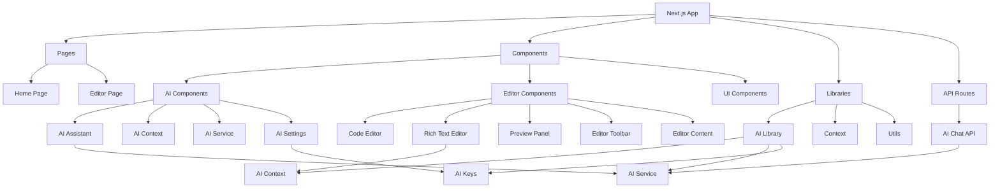
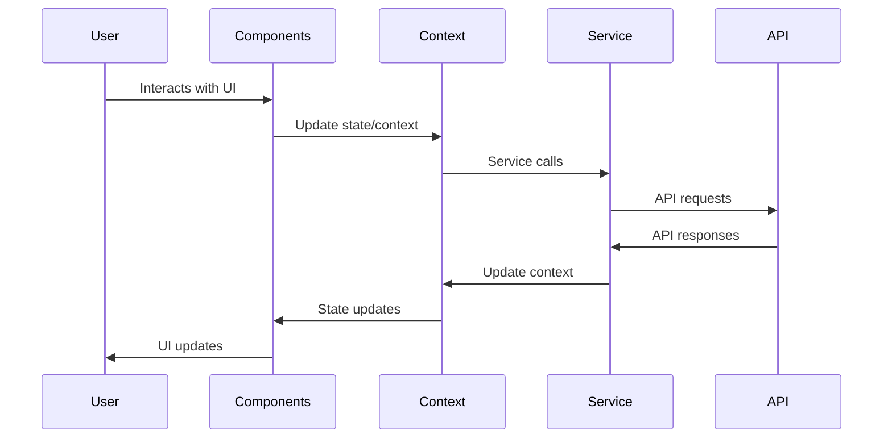

# Technical Documentation

This document provides detailed technical information about the MDX Editor project, including architecture, components, and implementation details.

## Technology Stack

### Frontend Framework
- **Next.js 15+**: React framework with App Router
- **TypeScript**: Type-safe JavaScript
- **Material-UI (MUI)**: Component library for UI
- **React Context API**: State management

### Editor Libraries
- **Monaco Editor**: Code editing experience
- **TipTap**: Rich text editing capabilities

### AI Integration
- **Vercel AI SDK**: AI service integration
- **@ai-sdk/openai**: OpenAI provider
- **@ai-sdk/google**: Google Gemini provider
- **@openrouter/ai-sdk-provider**: OpenRouter provider

### Markdown/MDX Processing
- **react-markdown**: Markdown rendering
- **remark-gfm**: GitHub Flavored Markdown support
- **rehype-raw**: HTML processing
- **react-syntax-highlighter**: Code syntax highlighting

## Project Architecture

## Component Structure

### AI Components

#### AI Assistant (`src/components/ai/AIAssistant.tsx`)
The main AI interface component that provides:
- Chat interface with message history
- Quick action buttons (improve, expand, summarize, correct)
- Provider selection
- Model selection for OpenRouter
- Settings integration

#### AI Context (`src/lib/ai/context.tsx`)
Manages AI state across the application:
- Selected provider and model
- Chat messages and loading states
- Service health checks
- API key change listeners

#### AI Service (`src/lib/ai/service.ts`)
Handles communication with AI providers:
- Message sending (streaming and non-streaming)
- Provider information management
- Health checks

#### AI Settings (`src/components/ai/AISettings.tsx`)
Runtime API key configuration:
- Secure input fields for API keys
- LocalStorage persistence
- Key visibility toggles
- Event dispatching for key changes

#### AI Keys Utility (`src/lib/ai/keys.ts`)
Utility functions for API key management:
- Retrieving runtime keys from localStorage
- Determining effective keys (runtime override environment)
- Clearing stored keys

### Editor Components

#### Editor Content (`src/components/editor/EditorContent.tsx`)
Main editor container that manages:
- Different editor modes (split, rich, view)
- Content synchronization between editors
- Split pane resizing
- Content conversion between formats

#### Code Editor (`src/components/editor/CodeEditor.tsx`)
Monaco Editor integration:
- Syntax highlighting for Markdown/MDX
- Real-time content updates
- Cursor position preservation
- Typing detection and optimization

#### Rich Text Editor (`src/components/editor/RichTextEditor.tsx`)
TipTap rich text editor:
- WYSIWYG editing experience
- Formatting toolbar
- Extension support (links, images, tables, etc.)

#### Preview Panel (`src/components/editor/PreviewPanel.tsx`)
Content rendering component:
- Markdown/MDX rendering with react-markdown
- Syntax highlighting for code blocks
- Custom component rendering for MDX
- Responsive design

#### Editor Toolbar (`src/components/editor/EditorToolbar.tsx`)
Formatting toolbar with:
- Common Markdown formatting actions
- MDX component insertion
- Editor mode switching
- AI assistant access

## API Structure

### AI Chat API (`src/app/api/ai/chat/route.ts`)
Edge API route for AI communication:
- POST endpoint for chat messages
- GET endpoint for health checks
- Provider-specific model configuration
- Runtime API key handling
- Streaming and non-streaming responses

## Data Flow

## State Management

The application uses React Context API for state management:

1. **AI Context**: Manages all AI-related state
2. **Theme Context**: Built-in Next.js/MUI theme management
3. **Responsive Context**: Screen size detection

## Implementation Considerations

### Performance Optimization

1. **Code Splitting**: Dynamic imports for heavy components
2. **Memoization**: `useMemo` and `useCallback` for expensive computations
3. **Virtualization**: For large content rendering
4. **Debouncing**: For rapid typing detection in editors
5. **Bundle Analysis**: Regular analysis with `@next/bundle-analyzer`

### Security

1. **API Key Storage**: localStorage with user-controlled persistence
2. **Environment Fallback**: Server-side environment variable handling
3. **Content Sanitization**: XSS protection in rendered content
4. **CSP Headers**: Content Security Policy configuration

### Error Handling

1. **API Errors**: Comprehensive error handling for AI service calls
2. **UI Errors**: Graceful degradation for component failures
3. **Network Errors**: Retry mechanisms and offline support
4. **Validation**: Input validation for all user interactions

### Accessibility

1. **ARIA Labels**: Proper labeling for all interactive elements
2. **Keyboard Navigation**: Full keyboard support
3. **Screen Reader**: Compatibility with screen readers
4. **Color Contrast**: Sufficient contrast for all UI elements

## Deployment Considerations

### Environment Variables

Required environment variables:
- `OPENAI_API_KEY`: OpenAI API key
- `GOOGLE_GENERATIVE_AI_API_KEY`: Google AI API key
- `OPENROUTER_API_KEY`: OpenRouter API key
- `DEFAULT_AI_PROVIDER`: Default AI provider (gemini, openai, openrouter)

### Build Process

1. **TypeScript Compilation**: Strict type checking
2. **ESLint**: Code quality enforcement
3. **Next.js Build**: Optimized production build
4. **Bundle Analysis**: Size optimization

### Hosting

Recommended hosting platforms:
- Vercel (optimal Next.js integration)
- Netlify
- Custom Node.js server

## Testing Strategy

### Unit Testing
- Component rendering tests
- Utility function tests
- Context provider tests

### Integration Testing
- Editor functionality tests
- AI service integration tests
- API route tests

### End-to-End Testing
- User workflow testing
- Cross-browser compatibility
- Performance testing

## Future Enhancements

1. **Collaborative Editing**: Real-time collaboration features
2. **Plugin System**: Extensible component architecture
3. **Advanced AI Features**: Image generation, code completion
4. **Export Options**: PDF, DOCX, and other format exports
5. **Version History**: Content versioning and rollback